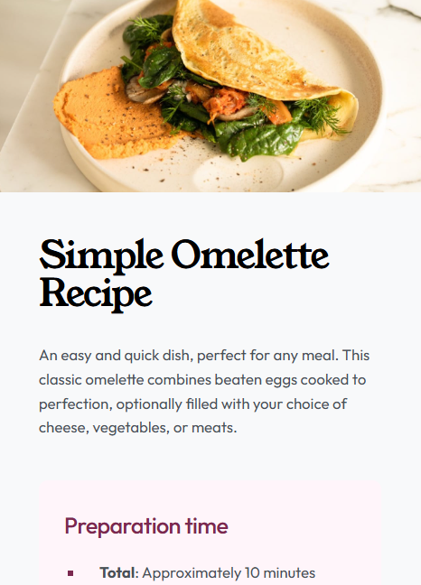

# Frontend Mentor - Recipe page solution

This is a solution to the [Recipe page challenge on Frontend Mentor](https://www.frontendmentor.io/challenges/recipe-page-KiTsR8QQKm). Frontend Mentor challenges help you improve your coding skills by building realistic projects.

## Table of contents

- [Overview](#overview)
  - [The challenge](#the-challenge)
  - [Screenshot](#screenshot)
  - [Links](#links)
- [My process](#my-process)
  - [Built with](#built-with)
  - [What I learned](#what-i-learned)
- [Author](#author)

## Overview

### Screenshot

<table> <tr> <td align="center"><strong>Desktop View</strong></td> <td align="center"><strong>Mobile View</strong></td> </tr> <tr> <td></td> <td></td> </tr> </table>

### Links

- Solution URL: [Github](https://github.com/ChiminFi/recipe-page-main-project)
- Live Site URL: [Live site](https://chiminfi.github.io/recipe-page-main-project/)

## My process

### Built with

- Semantic HTML5 markup
- CSS custom properties
- Flexbox
- Fluid Typography using clamp()

### What I learned

I focused on achieving a clean, "edge-to-edge" look for the nutrition table by using border-collapse and specific padding overrides. I also utilized the ::marker pseudo-element to align the list markers' color with the section headers, creating a cohesive visual identity.

Table Box Model: I learned that tr elements do not support padding due to the unique nature of the CSS Table Model. To achieve the desired spacing and "edge-to-edge" dividers, I applied padding to individual td n th elements and used border-collapse: collapse on the table itself.

Margin Collapse: I encountered a scenario where a child's vertical margin would "leak" through its parent, moving the entire container instead of creating space inside

## Author

- Website - [ChiminFi](https://github.com/ChiminFi)
- Frontend Mentor - [@chiminfi](https://www.frontendmentor.io/profile/ChiminFi)
